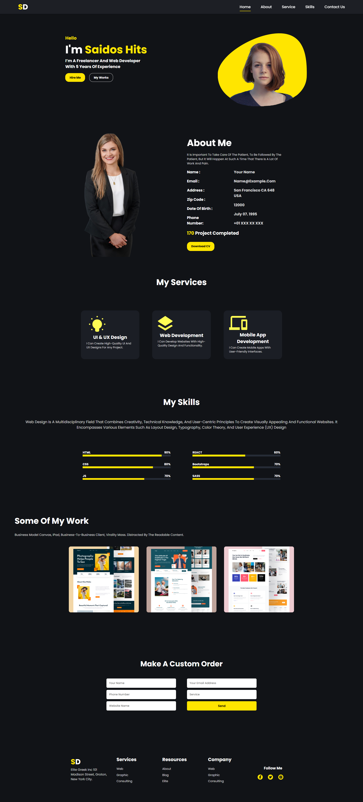

# Saidos Hits Portfolio Website




This is a personal portfolio website for **Saidos Hits**, showcasing their work, skills, and services in web development and design.

## Table of Contents
- [Demo](#demo)
- [Features](#features)
- [Installation](#installation)
- [Usage](#usage)
- [Technologies Used](#technologies-used)
- [Folder Structure](#folder-structure)
- [License](#license)

## Demo
You can view the live demo of this project at: [Saidos Hits Portfolio](#)

## Features
- **Responsive Design**: The website is optimized for different screen sizes, including mobile and desktop.
- **Smooth Animations**: Leveraging AOS (Animate on Scroll) and WOW.js libraries for animations.
- **Service and Skills Sections**: Highlights services offered and skills with progress bars.
- **Contact Form**: Users can fill out a contact form to reach out for services.
- **Social Media Integration**: Links to social media accounts.

## Installation

1. Clone this repository:
   ```bash
   git clone https://github.com/your-username/saidos-hits-portfolio.git
